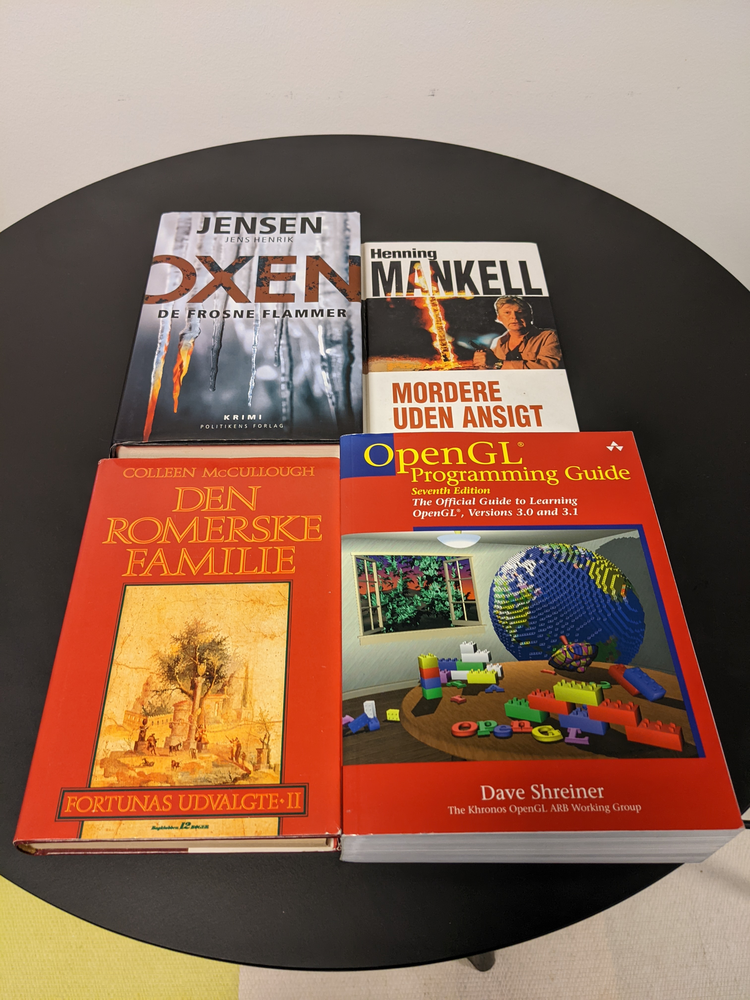

# 1Minute Computer Vision Algorithm

1Minute Computer Vision Algorithm is an example to demonstrate the state-of-the-art techniques using a basic framework.

## Installation
```
pip install -r requirements.txt
```

### Dependencies / Prerequisites
See [requirements](requirements.txt).

### Supported Architectures / Versions
1Minutes Computer Vision Algorithm is tested on Python 3.7+ on Windows and Linux.

## Execute
```
python run.py --h
```

## Examples
This is an example to show how to recongize a book in a photo using some images downloaded from the book publisher.
```
python run.py --detector ORB --descriptor ORB --matcher BF
```
Sample:<br>



Result:<br>


## License
This project is licensed under MIT. See [LICENSE](LICENSE).
